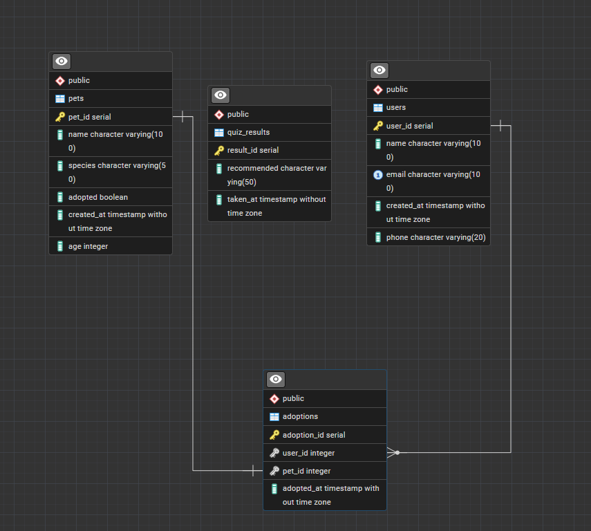

# Pet Match – Pet Adoption Platform

A console-based application I built in Java to practice JDBC and database design. The idea came from wanting to build something more fun than a typical CRUD app — so I made a pet adoption system where users can browse available pets, adopt them and even take a quiz to find their perfect match.

## What I built

- Built a Java console application with full CRUD functionality, connecting to a PostgreSQL database via JDBC to manage users, pets and adoptions.
- Applied PreparedStatement throughout to prevent SQL injection and ensure secure, validated database access.
- Designed a 5-question lifestyle compatibility quiz that recommends a pet species based on user answers and persists results to the database.
- Implemented adoption statistics, species filtering and a waiting list showing pets that have been available the longest.

## Project Structure

- `Main.java` — menu-driven entry point with 10 features
- `Pet_db.java` — pet management and search
- `User_db.java` — user management
- `Adoption_db.java` — adoption logic and statistics
- `AdoptionQuiz.java` — compatibility quiz with database persistence
- `DataBaseConnection.java` — JDBC connection handler

## Database Diagram

## Features

- Add users and pets
- Adopt a pet with duplicate adoption prevention
- Search pets by species
- View adoption history and statistics
- Find your perfect pet with the compatibility quiz
